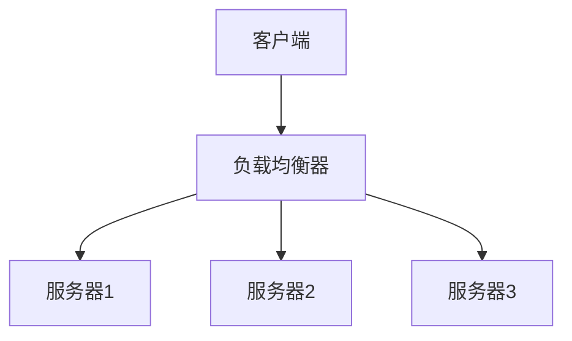

# 系统设计基础

## 概述

系统设计是构建大型软件系统的核心技能。本书介绍系统设计的基本概念、原则和实际应用。

---

## 第1章：系统设计概述

### 什么是系统设计？

系统设计是定义系统架构、组件、模块、接口和数据的过程，以满足特定的需求。

### 设计目标

- **可扩展性**：系统能够处理增长的负载
- **可用性**：系统保持运行的能力
- **性能**：系统的响应速度
- **可维护性**：系统的可修改性和可理解性

### 设计流程

```
需求分析 → 概要设计 → 详细设计 → 实现 → 测试 → 部署
```

---

## 第2章：可扩展性设计

### 水平扩展 vs 垂直扩展

#### 垂直扩展
- **定义**：增加单个服务器的资源（CPU、内存、存储）
- **优点**：简单，无需修改代码
- **缺点**：有物理限制，单点故障

#### 水平扩展
- **定义**：增加更多服务器
- **优点**：理论上无限扩展，高可用性
- **缺点**：架构复杂，需要考虑一致性

### 负载均衡



#### 常见算法
- **轮询**：按顺序分配请求
- **最少连接**：分配给连接数最少的服务器
- **IP哈希**：基于客户端IP分配

### 数据库扩展

#### 读写分离

```
主库 (写操作)
    ↓
从库1 (读操作)
从库2 (读操作)
从库3 (读操作)
```

#### 分库分表

**水平分表**：按行拆分表
```sql
-- 用户表按ID范围拆分
users_1: id 1-10000
users_2: id 10001-20000
users_3: id 20001-30000
```

**垂直分库**：按功能模块拆分
```
用户数据库：用户信息、认证
订单数据库：订单、支付
产品数据库：商品、库存
```

---

## 第3章：高可用性设计

### 可用性指标

- **可用性百分比** = (总时间 - 故障时间) / 总时间 × 100%
- **99.9%**：每月约43分钟故障时间
- **99.99%**：每月约4.3分钟故障时间
- **99.999%**：每月约26秒故障时间

### 冗余设计

#### 服务器冗余

```
主服务器 (活跃)
    ↓
备用服务器 (待命)
```

#### 数据冗余

**主从复制**
```
主数据库 → 从数据库1
         → 从数据库2
         → 从数据库3
```

**多主复制**
```
主数据库1 ←→ 主数据库2 ←→ 主数据库3
```

### 故障检测与恢复

#### 心跳检测

```python
import time
import requests

def health_check(service_url, interval=30):
    while True:
        try:
            response = requests.get(f"{service_url}/health", timeout=5)
            if response.status_code == 200:
                print(f"Service {service_url} is healthy")
            else:
                print(f"Service {service_url} is unhealthy: {response.status_code}")
        except requests.exceptions.RequestException as e:
            print(f"Service {service_url} is down: {e}")

        time.sleep(interval)
```

#### 自动故障转移

```yaml
# Kubernetes 示例
apiVersion: v1
kind: Pod
spec:
  containers:
  - name: app
    image: myapp:1.0
    livenessProbe:
      httpGet:
        path: /health
        port: 8080
      initialDelaySeconds: 30
      periodSeconds: 10
    readinessProbe:
      httpGet:
        path: /ready
        port: 8080
      initialDelaySeconds: 5
      periodSeconds: 5
```

---

## 第4章：缓存策略

### 缓存类型

#### 内存缓存

```java
// Guava Cache 示例
Cache<String, String> cache = CacheBuilder.newBuilder()
    .maximumSize(1000)
    .expireAfterWrite(10, TimeUnit.MINUTES)
    .build();

String value = cache.get(key, () -> expensiveOperation(key));
```

#### 分布式缓存

```python
# Redis 示例
import redis

r = redis.Redis(host='localhost', port=6379, db=0)

# 设置缓存
r.setex('user:123', 3600, json.dumps(user_data))

# 获取缓存
cached_data = r.get('user:123')
if cached_data:
    return json.loads(cached_data)
else:
    data = fetch_from_database(123)
    r.setex('user:123', 3600, json.dumps(data))
    return data
```

### 缓存模式

#### Cache-Aside (旁路缓存)

```
应用 → 缓存
    ↓    ↓
   数据库 ← 无数据时
```

#### Write-Through (写穿透)

```
应用 → 缓存 → 数据库
```

#### Write-Behind (写回)

```
应用 → 缓存 → 异步 → 数据库
```

### 缓存失效策略

1. **TTL (Time To Live)**：设置过期时间
2. **LRU (Least Recently Used)**：淘汰最近最少使用的
3. **LFU (Least Frequently Used)**：淘汰使用频率最低的
4. **FIFO (First In First Out)**：先进先出

---

## 第5章：消息队列

### 使用场景

1. **解耦系统**：生产者和消费者独立运行
2. **异步处理**：提高系统响应速度
3. **流量削峰**：处理突发流量
4. **可靠性**：确保消息不丢失

### 消息队列类型

#### 点对点 (Point-to-Point)

```
生产者 → 队列 → 消费者1
                → 消费者2 (但只有一个能消费)
```

#### 发布订阅 (Publish-Subscribe)

```
发布者 → 主题 → 订阅者1
               → 订阅者2
               → 订阅者3
```

### 实现示例

```python
# RabbitMQ 示例
import pika

# 生产者
connection = pika.BlockingConnection(pika.ConnectionParameters('localhost'))
channel = connection.channel()
channel.queue_declare(queue='task_queue')

message = "Hello World!"
channel.basic_publish(exchange='',
                      routing_key='task_queue',
                      body=message,
                      properties=pika.BasicProperties(
                         delivery_mode=2,  # 持久化消息
                      ))
print(f" [x] Sent '{message}'")
connection.close()

# 消费者
def callback(ch, method, properties, body):
    print(f" [x] Received {body.decode()}")
    ch.basic_ack(delivery_tag=method.delivery_tag)

channel.basic_consume(queue='task_queue', on_message_callback=callback)
print(' [*] Waiting for messages. To exit press CTRL+C')
channel.start_consuming()
```

---

## 第6章：监控与日志

### 监控指标

#### 系统指标
- **CPU使用率**：处理器负载
- **内存使用率**：内存占用
- **磁盘I/O**：读写性能
- **网络流量**：带宽使用

#### 应用指标
- **QPS (Queries Per Second)**：每秒查询数
- **响应时间**：请求处理时间
- **错误率**：失败请求比例
- **并发用户数**：同时在线用户

### 监控系统架构

```
应用 → 指标收集 → 存储系统 → 可视化界面
      ↓           ↓           ↓
   日志收集 → 日志聚合 → 日志分析
```

### 日志管理

#### 日志级别
- **DEBUG**：调试信息
- **INFO**：一般信息
- **WARN**：警告信息
- **ERROR**：错误信息
- **FATAL**：致命错误

#### 结构化日志

```json
{
  "timestamp": "2024-01-15T10:30:00Z",
  "level": "INFO",
  "service": "user-service",
  "message": "User login successful",
  "user_id": "12345",
  "ip_address": "192.168.1.100",
  "duration_ms": 150
}
```

---

## 总结

系统设计是一个需要综合考虑多个因素的复杂过程：

1. **理解需求**：明确功能和非功能需求
2. **权衡取舍**：在不同目标间做出平衡
3. **渐进优化**：从简单开始，逐步优化
4. **持续监控**：监控系统的实际表现
5. **不断学习**：学习新的技术和模式

记住：没有完美的系统设计，只有适合当前场景的设计。

---

*更多内容持续更新中...*